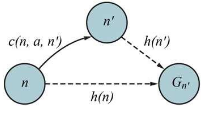

# Problem-solving agents

- **Problem-solving agent**: an agent that decides what to do by finding sequences of actions that lead to desirable states.
- **Search**: the process of looking for a sequence of actions that reaches the goal.
- Uses atomic representation of states and actions.
- These agents are goal-based.
- Used when the environment is,
  - Fully observable.
  - Single-agent.
  - Episodic.
  - Static.
  - Discrete.
  - Deterministic.

## Problem-solving Process

1. **Goal formulation**: defining the goal.
2. **Problem formulation**: defining the problem.
3. **Search**: looking for a sequence of actions that reaches the goal.
4. **Execution**: following the sequence of actions.

## Problem-solving Components/Glossary

- **State**: a configuration of the world.
- **State space**: the set of all states reachable from the initial state by any sequence of actions.
- **Initial state**: the starting state.
- **Goal state(s)**: the desired state(s).
- **Actions**: actions that the agent can take.
- **Transition model**: a description of what each action does.
- **Path**: a sequence of states connected by a sequence of actions.
- **Solution**: a path from the initial state to a goal state.
  - **Optimal solution**: a solution with the lowest cost.
- **Search graph**: a graph where nodes are states and edges are actions.
- **Model**: an abstract description of the world.
  - **Abstraction**: a simplified version.
- **Action cost function**: the cost of each action.
- **Heuristic function**: a function that estimates the cost of reaching the goal from a given state.

> ### Example: Vacuum World
>
> - **State**: the location of the agent and the dirtiness of each location.
> - **Initial state**: any state can be the initial state.
> - **Actions**: `Forward`, `Backward`, `TurnLeft`, `TurnRight`, `Suck`.
> - **Transition model**:
>   - the effect that each action has on the state.
>   - e.g. `Suck` makes the current location clean.
>   - actions can have no effect depending on the state.
> - **Goal states**: all locations are clean. multiple goal states because agent could be in any location.
> - **Action cost**: 1 for all actions.

## Tree Search Algorithms

- **Uninformed search**: search algorithms that do not use problem-specific knowledge.
- **Informed search**: search algorithms that use problem-specific knowledge.

### Search Tree

- **Search tree**: a tree where nodes are states and edges are actions.
- **Node**: a state.
- **Root node**: the initial state.
- **Frontier**: the set of nodes that have been generated but not yet expanded.
- **Redundant paths**: paths that lead to the same state.

### Performance Measures

- **Complete**: a search algorithm that always finds a solution if one exists, or proves that no solution exists.
- **Optimal**: a search algorithm that finds the optimal solution.
- **Time complexity**: the number of nodes/actions considered.
- **Space complexity**: the maximum number of nodes stored in memory.
- Time and space complexity are measured in terms of,
  - **b**: the branching factor (average number of children).
  - **d**: the depth of the shallowest goal state.
  - **m**: the maximum number of nodes in any path.

### Uninformed Search Algorithms

- Only use the information available in the problem definition. i.e. no domain-specific knowledge.
- Main difference is the expansion policy.

#### Breadth-First Search (BFS)

- **Expansion policy**: shallowest unexpanded node.
- **Complete**: yes, if $b$ is finite.
- **Optimal**: yes, if the cost of each action is the same.
- **Time complexity**: $O(b^d)$. Need to keep every node in memory until the goal is found.
- **Space complexity**: $O(b^d)$.
- **Notes**:
  - Space complexity is a problem for large $b$ and $d$.

#### Uniform-Cost Search (Dijkstra's Algorithm)

- **Expansion policy**: node with the lowest path cost.
- **Complete**: yes, if the cost of each action is positive, non-zero.
- **Optimal**: yes.
- **Time complexity**: $O(b^{1 + \lfloor C^*/\epsilon \rfloor})$ where $C^*$ is the cost of the optimal solution and $\epsilon$ is the minimum cost of any action.
- **Space complexity**: $O(b^{1 + \lfloor C^*/\epsilon \rfloor})$.

#### Depth-First Search (DFS)

- **Expansion policy**: deepest unexpanded node.
- **Complete**: Yes, if the search tree is finite and there are no redundant paths.
- **Optimal**: No.
- **Time complexity**: $O(b^m)$.
- **Space complexity**: $O(bm)$.

#### Depth-Limited Search

- **Expansion policy**: deepest unexpanded node. If the depth limit is reached, the node is treated as if it has no children.
- **Complete**: No, if the depth limit is less than the depth of the shallowest goal state.
- **Optimal**: No.
- **Time complexity**: $O(b^l)$ where $l$ is the depth limit.
- **Space complexity**: $O(bl)$.

#### Iterative Deepening Search

- Multiple depth-limited search with increasing depth limits.
- Comparable to BFS in terms of time complexity.
- **Complete**: Yes.
- **Optimal**: Yes, if the cost of each action is the same.
- **Time complexity**: $O(b^d)$.
- **Space complexity**: $O(bd)$.

#### Bidirectional Search

- Simultaneous BFS from the initial state and the goal state.

### Informed Search Algorithms

- Use problem-specific knowledge.
- This knowledge is used to estimate the cost of reaching the goal from a given state without considering the cost of actions.
- The main difference between algorithms is the evaluation function used to select the node to expand.

> **Best-first search**:
>
> - A family of search algorithms that selects the next expanding node with the most desirable evaluation function value.
> - $f(n)$ is the evaluation function.
> - E.g. Uniform-cost search, Greedy best-first search, A\* search.

#### **Heuristic function**:

- A function that estimates the cost of reaching the goal from a given state.
- **Admissible heuristic**: a heuristic that never overestimates the cost of reaching the goal.
- **Consistent heuristic**:
  - a heuristic that is admissible and satisfies the triangle inequality.
  - They are admissible but not vice versa.
  - $h(n) \leq c(n, a, n') + h(n')$ where $c(n, a, n')$ is the cost of taking action $a$ from $n$ to $n'$.

- Heuristic function used affects the optimality of the informed search algorithms.
- Difining heuristic functions:
  - **Relaxed problem**: a simplified version of the problem where some constraints are removed.
  - **Pattern database**: a database of optimal solutions to subproblems. This can be used correctly to estimate the cost of reaching the goal from a given state.

#### Greedy Best-First Search

- **Evaluation function**:
  - $h(n)$ gives the estimated cost of reaching the goal from node $n$.
  - minimize $f(n) = h(n)$
- **Complete**: No.
- **Optimal**: No.
- **Time complexity**: $O(b^m)$.
- **Space complexity**: $O(b^m)$.

#### A\* Search

- **Evaluation function**:
  - $g(n)$ is the cost of the path from the initial state to node $n$.
  - $h(n)$ is the estimated cost of reaching the goal from node $n$.
  - minimize $f(n) = g(n) + h(n)$
- **Complete**: Yes.
- **Optimal**: Yes, if the heuristic is admissible. May not be optimal if the heuristic is inadmissible.
- **Space complexity**: $O(b^d)$.
- **Time complexity**: $O(b^d)$.

#### Bidirectional A\* Search

- Simultaneous A\* search from the initial state and the goal state.
- More efficient than A\* search.

#### Iterative Deepening A\* Search

- Multiple A\* search with increasing depth limits.
- Addresses the space complexity issue of A\* search.
