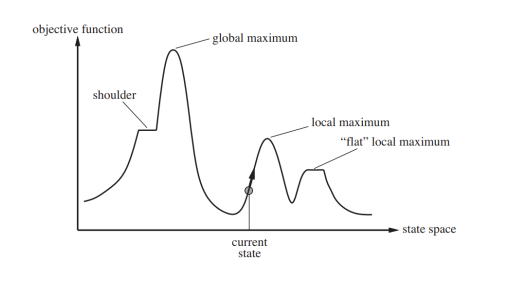
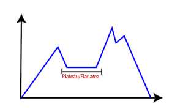
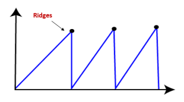

# Local Search Algorithms

- Local search algorithms are optimization techniques used to find solutions by iteratively moving to neighboring states.
- They are particularly useful when.
  - Dealing with problems with large or infinite state spaces.
  - The path to the solution is not important, only the final state (i.e., identifying one of the goal states).
  - The optimal solution is not required, only a good enough solution.
- They are not systematic. (i.e., might not explore all possible states)
- **Advantages:**
  - Uses less memory.
  - Can find solutions in large or infinite state spaces.

| Aspect              | Local Search                                                                | Tree Search                                                           |
| ------------------- | --------------------------------------------------------------------------- | --------------------------------------------------------------------- |
| Initial State       | Start with a complete state and improve it by moving to neighboring states. | Start with an empty state and build it by adding components.          |
| Goal test           | No explicit goal test. The search stops when no better neighbor is found.   | Explicit goal test to check if the current state is a solution.       |
| Optimizing function | Uses an **Objective Function** to evaluate the quality of a state.          | Uses a **Heuristic Function** to estimate the cost to reach the goal. |
| Output              | A single state that is a goal state or a good enough solution.              | A sequence of actions to reach the goal state.                        |

> ## Visualization
>
> Consider a 2D space with a mountainous terrain. The goal is to find the highest peak.
> Elevations are objective function values.
>
> 
>
> - **Local Maxima:** A point where the value is higher than its neighbors but not the global highest.
> - **Plateaus:** A flat region where all neighbors have the same value.
>
>   
>
> - **Ridges:** A sequence of alternating high and low values.
>
>   

## Hill Climbing

- Hill Climbing is a straightforward algorithm that continually moves towards increasing value, or uphill, to find the peak of the mountain (optimal solution).

- **Steepest-Ascent Hill Climbing:**

  - Examines all neighboring states.
  - Moves to the neighbor with the highest objective function value.
  - More thorough but can be slower due to evaluating all neighbors.

- **Stochastic Hill Climbing:**

  - Selects a random neighbor and evaluates it.
  - Probability of moving to a neighbor depends on the improvement.
  - Introduces randomness to escape local maxima and plateaus.

- **First-Choice Hill Climbing:**

  - Generates successors randomly until a better one is found.
  - Faster than steepest-ascent when there are many neighbors.

- **Random-Restart Hill Climbing:**
  - Performs multiple hill-climbing searches from different random initial states.
  - Save the best result from all searches.
  - If all states have an equal probability of being generated, it is **complete** with probability approaching 1 as the number of restarts increases.
  - Combats local maxima by exploring different parts of the state space.

```python
def hill_climbing(problem):
    current = make_node(problem.initial_state)
    while True:
        neighbor = highest_valued_successor(current)
        if neighbor.value <= current.value:
            return current.state
        current = neighbor
```

### Challenges in Hill Climbing

- **Local Maxima:** Peaks that are higher than surrounding states but lower than the global maximum.
- **Plateaus:** Flat areas where neighboring states have the same value, causing the algorithm to wander.
- **Ridges:** Sequences of states that require movements in non-obvious directions to ascend.

## Simulated Annealing

- Simulated Annealing introduces randomness to escape local maxima by occasionally allowing moves to worse states.
- **Process:**
  - Accept worse moves based on a probability that decreases over time. $$ P(\Delta E) = e^{\frac{\Delta E}{T}} $$
  - Initially, the algorithm wanders widely, accepting many worse moves.
  - As time progresses, the probability of accepting worse moves decreases.
- **Advantage:** It can find a global optimum by avoiding getting trapped in local optima.

```python
def simulated_annealing(start, schedule):
    current = start
    for t in range(sys.maxsize):
        T = schedule(t)
        if T == 0:
            return current
        next = random.choice(successors(current))
        delta_e = next.value - current.value
        if delta_e > 0 or random.random() < math.exp(delta_e / T):
            current = next
```

- **Schedule Function:** A function that determines the temperature at each step.
- **Example:** $$ T(t) = \frac{T_0}{1 + \frac{t}{k}} $$
  - \( T_0 \): Initial temperature.
  - \( k \): Cooling rate.


## Local Beam Search

- Local Beam Search keeps track of multiple states instead of just one.
- **Process:** Begin with \( k \) random states, generate all successors, and select the best \( k \) as the new current states.
- **Stochastic Beam Search:** Selects \( k \) successors randomly.

## Genetic Algorithms

- A variant of _stochastic beam search_.
- Genetic Algorithms simulate the process of natural selection.
- A state is represented as a string over a finite alphabet. (e.g., a binary string)
- **Process:** Maintain a population of candidate solutions, and use crossover and mutation to generate new offspring.
- **Concepts:**
  - **Selection:** Choose the fittest individuals for reproduction.
  - **Crossover:** Combine parts of two individuals to create offspring.
  - **Mutation:** Randomly alter an individual to introduce variation.
  - **Elitism:** Preserve the best parents through each generation.
  - **Culling:** Remove the worst individuals to maintain a constant population size.
- Selction strategies:
  - Random selection.
  - Selection probability proportional to fitness.
  - Selection made with replacement to allow very fit individuals to be selected multiple times.
- Crossover procedure:
  - Choose random pairs of parents.
  - Select a random crossover point.
  - Create offspring(s).

```python
def REPRODUCE(x, y):
    n = len(x)
    c = random.randint(1, n)
    return x[:c] + y[c:]

def GA(pop, fitness_fn, max_generations=100, mutation_prob=0.1):
    for generation in range(max_generations):
        new_pop = []
        for _ in range(len(pop)):
            x = random.choices(pop, weights=[fitness_fn(i) for i in pop])[0]
            y = random.choices(pop, weights=[fitness_fn(i) for i in pop])[0]
            child = REPRODUCE(x, y)
            if random.random() < mutation_prob:
                child = mutate(child)  # Assuming you have a mutate function defined
            new_pop.append(child)
        pop = new_pop

        # Check for early termination based on fitness or time
        best_fitness = max(fitness_fn(i) for i in pop)
        if best_fitness >= target_fitness:
            break

    return max(pop, key=fitness_fn)
```

### Comments on Genetic Algorithms

- **Positive points:**
  - Randomness helps in escaping local optima (from crossovers primarily).
  - Appealing connection to natural selection.
- **Negative points:**
  - Many parameters to tune.
  - Highly dependent on the problem domain.
  - Can be computationally expensive.
  - Lack of of empirical evidence of superiority over other methods.
