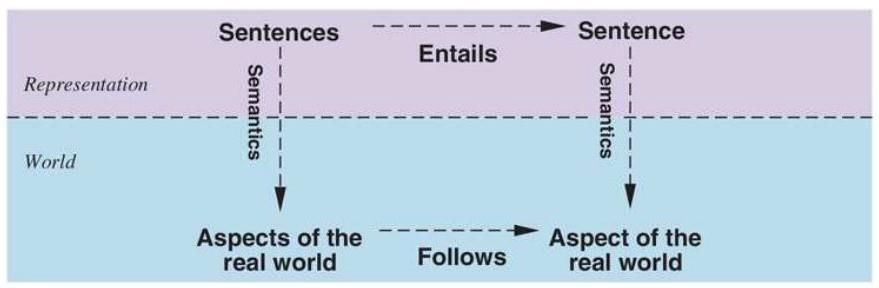

# Logical Agents

> - Agents
>   - Problem-solving agents
>     - The agent decides what to do by finding sequences of actions that lead to desirable states.
>   - Knowledge-based agents
>     - The agent decides what to do by reasoning about the world.

## Knowledge-Based Agents

- **Knowledge-based agents**:

  - The agent decides what to do by reasoning about the world. **(representation -> reasoning -> action)**
  - The agent uses a **knowledge base** to store information.
  - The agent uses inference functions to manipulate the information.

- **Knowledge Base**:

  - A set of sentences in a formal language that represents the world.
  - **Syntax**: The structure of the sentences.
  - **Semantics**: The meaning of the sentences.
  - Related inference functions:
    - **Tell**: Add a sentence to the knowledge base.
    - **Ask**: Query the knowledge base.

```python
def KB_AGENT(percept):

    # TELL the KB about the percept
    TELL(KB, MAKE_PERCEPT_SENTENCE(percept, t))

    # ASK the KB for an action
    action = ASK(KB, MAKE_ACTION_QUERY(t))

    # TELL the KB about the action
    TELL(MAKE_ACTION_SENTENCE(action, t))

    t += 1

    return action
```

## Logic Languages

> - **Syntax**:
>   - The structure of the sentences.
> - **Semantics**:
>   - The meaning of the sentences.

## Propositional logic

- A simple language for reasoning about propositions.

### Syntax

- **Atomic sentence**:
  - A proposition symbol (e.g., $P$, $Q$).
  - A simple sentence that can be either true or false.
- **Operators**:

  | Operator   | Name          | Meaning        |
  | ---------- | ------------- | -------------- |
  | $\neg$     | Negation      | Not            |
  | $\land$    | Conjunction   | And            |
  | $\lor$     | Disjunction   | Or             |
  | $\implies$ | Implication   | If-then        |
  | $\iff$     | Biconditional | If and only if |

  Priority: $\neg$ > $\land$ > $\lor$ > $\implies$ > $\iff$.

- **Literal**:
  - An atomic sentence or its negation.
  - E.g., $P$ or $\neg P$.

### Semantics

- **Model**:
  - An assignment of truth values to proposition symbols.
  - E.g., $m_1 = \{P = \text{True}, Q = \text{False}\}$
- **Satisfies**:
  - A model satisfies a sentence if the sentence is true in that model.
  - $\textbf{M(s)}$: The set of models that satisfy sentence $s$.
- **Satisfiable**:
  - A sentence is satisfiable if there is a model that makes it true.
  - $\textbf{M(s)} \neq \emptyset$
- **Unsatisfiable**:
  - A sentence is unsatisfiable if there is no model that makes it true.
  - $\textbf{M(s)} = \emptyset$.
- **Valid**:
  - A sentence is valid if it is true in all models.
  - $\textbf{M(s)} = \textbf{M(T)}$
- **Entails**:
  - A sentence $s_1$ entails $s_2$ if all models that satisfy $s_1$ also satisfy $s_2$.
  - $M(s_1) \subseteq M(s_2)$
  - $\textbf{s_1} \models \textbf{s_2}$

## Inference

- Deriving new sentences from old ones.
- **Grounding**:

  - If KB is true in real world, then any derived sentence is also true in real world.

  

### Model checking

- Verify if a sentence is true by checking it against all possible models that satisfy the entire knowledge base.
- $KB \models \alpha \iff M(KB \land \neg \alpha) = \emptyset$

### Theorem proving

- Apply inference rules to KB to derive new sentences.
- No need to consider all possible models.

- **Logical equivalence**:

  > Two sentences are logically equivalent if they are true in the same models.
  >
  > $s_1 \equiv s_2 \iff M(s_1) = M(s_2)$

  | Property                              | Logical Equivalence                                                                           |
  | ------------------------------------- | --------------------------------------------------------------------------------------------- |
  | Commutativity of $\land$              | $(\alpha \land \beta) \equiv (\beta \land \alpha)$                                            |
  | Commutativity of $\lor$               | $(\alpha \lor \beta) \equiv (\beta \lor \alpha)$                                              |
  | Associativity of $\land$              | $((\alpha \land \beta) \land \gamma) \equiv (\alpha \land (\beta \land \gamma))$              |
  | Associativity of $\lor$               | $((\alpha \lor \beta) \lor \gamma) \equiv (\alpha \lor (\beta \lor \gamma))$                  |
  | Double Negation Elimination           | $\neg\neg\alpha \equiv \alpha$                                                                |
  | Contraposition                        | $(\alpha \to \beta) \equiv (\neg\beta \to \neg\alpha)$                                        |
  | Implication Elimination               | $(\alpha \to \beta) \equiv (\neg\alpha \lor \beta)$                                           |
  | Biconditional Elimination             | $(\alpha \leftrightarrow \beta) \equiv ((\alpha \to \beta) \land (\beta \to \alpha))$         |
  | De Morgan's Law (1)                   | $\neg(\alpha \land \beta) \equiv (\neg\alpha \lor \neg\beta)$                                 |
  | De Morgan's Law (2)                   | $\neg(\alpha \lor \beta) \equiv (\neg\alpha \land \neg\beta)$                                 |
  | Distributivity of $\land$ over $\lor$ | $(\alpha \land (\beta \lor \gamma)) \equiv ((\alpha \land \beta) \lor (\alpha \land \gamma))$ |
  | Distributivity of $\lor$ over $\land$ | $(\alpha \lor (\beta \land \gamma)) \equiv ((\alpha \lor \beta) \land (\alpha \lor \gamma))$  |

- **Validity**:

  > A sentence is valid if it is true in all models.
  > They are also called **tautologies**.
  > Used in developing inference rules.
  >
  > $\models \alpha \iff M(\alpha) = M(T)$

- **Satisfiability**:

  > A sentence is satisfiable if there is a model that makes it true.
  > Can be checked by enumerating all possible models and finding one that satisfies the sentence.
  >
  > $\alpha \text{ is valid} \implies \neg\alpha \text{ is unsatisfiable}$
  >
  > Contrapositive: $\alpha \text{ is satisfiable} \implies \neg\alpha \text{ is not valid}$

- **Monotonicity**:

  > Adding more sentences to the knowledge base should not break the existing inferences.
  >
  > $KB \models \alpha \implies KB \land \beta \models \alpha$

#### Modus Ponens

- If $\alpha \implies \beta$ and $\alpha$ are true, then $\beta$ is true.

$$\frac{\alpha \implies \beta, \alpha}{\beta}$$

#### Elimination of $\land$

- If $\alpha \land \beta$ is true, then $\alpha$ and $\beta$ are true.

$$\frac{\alpha \land \beta}{\alpha} \quad \frac{\alpha \land \beta}{\beta}$$

#### Elimitation from equivalences

- Any logical equivalence can be used to derive new sentences.

$$(\alpha \iff \beta) \equiv ((\alpha \to \beta) \land (\beta \to \alpha))$$

$$\frac{\alpha \iff \beta}{(\alpha \implies \beta) \land (\beta \implies \alpha)} \quad \frac{\alpha \iff \beta}{(\beta \implies \alpha) \land (\alpha \implies \beta)}$$

#### Resolution

- A general inference rule that can be used to derive new sentences.

$$\frac{\alpha \lor \beta, \neg\alpha \lor \gamma}{\beta \lor \gamma}$$

- **Resolution refutation**:

  - A proof by contradiction.
  - To show that $\alpha$ is true, show that $\neg\alpha$ is false.
  - If $\neg\alpha$ is false, then $\alpha$ is true.

#### CNF (Conjunctive Normal Form)

- A sentence is in CNF if it is a conjunction of disjunctions of literals.

$$\alpha = (P \lor Q) \land (\neg P \lor R) \land (Q \lor \neg R)$$

- **Conversion to CNF**:

  - Eliminate $\iff$ and $\implies$.
  - Move $\neg$ inwards using De Morgan's laws.
  - Distribute $\lor$ over $\land$.

- **Resolution in CNF**:
  - Convert the knowledge base to CNF.
  - Apply resolution to derive new sentences.
